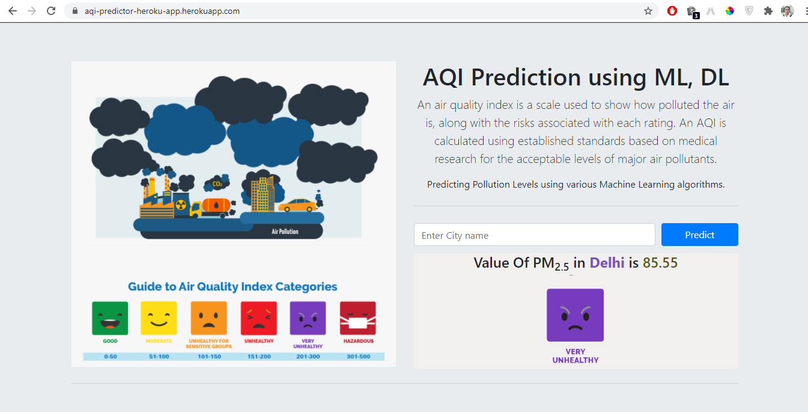

# AQI_Prediction
Air Quality Index Predictor

#### WebLink: https://aqi-predictor-heroku-app.herokuapp.com/

The air quality index (AQI) is an index for reporting air quality on a daily basis. It is a measure of how air pollution affects one's health within a short time period. The purpose of the AQI is to help people know how the local air quality impacts their health. The Environmental Protection Agency (EPA) calculates the AQI for five major air pollutants, for which national air quality standards have been established to safeguard public health.

        T Average Temperature (°C)
        TM Maximum temperature (°C)
        Tm Minimum temperature (°C)
        SLP Atmospheric pressure at sea level (hPa)
        H Average relative humidity (%)
        VV Average visibility (Km)
        V Average wind speed (Km/h)
        VM Maximum sustained wind speed (Km/h)

### API Used https://openweathermap.org/

### Output:

